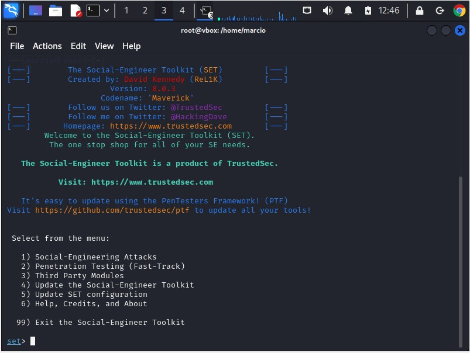
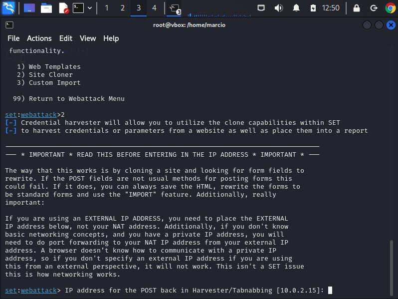

# Phishing para captura de senhas do Facebook
<h3> Projeto prático do Bootcamp DIO/Santander de Cybersegurança </h3>

<h2>Ferramentas</h2> 
<li>Kali Linux</li>
<li>setoolkit</li>

<h2>Configurando o Phishing no Kali Linux</h2>
<li>Acesso root: sudo su</li>

 
<li>Iniciando o setoolkit: </li>
Digite na linha de comando: setoolkit

<li>Tipo de ataque: Social-Engineering Attacks</li>
 

<li>Vetor de ataque: Web Site Attack Vectors</li>
 

<li>Método de ataque: Credential Harvester Attack Method</li>
 

<li>Método de ataque: Site Cloner</li>
 

<li>Obtendo o endereço da máquina: ifconfig</li>
 

<li>URL para clone: http://www.facebook.com</li>
 

<h2>Resultados:</h2>
 

